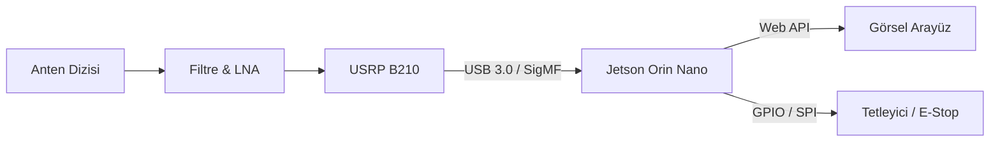

# 🛠️ Aegis-AI Donanım Stratejisi ve Sistem Mimarisi

TEKNOFEST 2026 Elektronik Harp yarışması için belirlenen "Otonomi", "Hızlı Tarama" ve "Etkili Karıştırma" hedefleri doğrultusunda optimize edilmiş donanım mimarisidir.

## 1. Ana Kontrol ve İşleme Birimi (C&C)
Sistem, gerçek zamanlı sinyal işleme ve yapay zeka çıkarımı için yüksek performanslı ve düşük güç tüketimli bir birime ihtiyaç duyar.

*   **Öneri:** **NVIDIA Jetson Orin Nano / Orin NX**
    *   **Neden:** CUDA çekirdekleri sayesinde FFT ve CNN (Sinyal Sınıflandırma) işlemlerini "Real-Time" yapabilir.
    *   **Alternatif:** Kompakt bir Intel NUC (i7 + Iris Xe) yüksek bant genişliğinde veri iletimi (USB 3.0/Thunderbolt) için tercih edilebilir.

## 2. Yazılım Tanımlı Radyo (SDR) Birimi
Yarışma hem ED (Dinleme) hem de ET (Müdahale) gerektirdiği için Full-Duplex bir SDR kritiktir.

*   **Birincil Seçenek:** **Ettus USRP B210**
    *   **Kabiliyet:** 70 MHz - 6 GHz frekans aralığı, 56 MHz anlık bant genişliği.
    *   **Avantaj:** 2x2 MIMO (İki kanal alma, iki kanal verme). Yön Bulma (DF) için iki anten girişi aynı anda kullanılabilir.
*   **Bütçe Dostu:** **ADALM-Pluto (PlutoSDR)**
    *   **Kabiliyet:** Genişletilmiş frekans (325 MHz - 6 GHz), Full-Duplex.
*   **DF Uzmanlığı:** **KrakenSDR**
    *   **Kabiliyet:** 5 kanallı koherent RX. Sadece Yön Bulma (DoA) için mükemmeldir.

## 3. Anten Sistemi
Geniş spektrumlu tarama ve odaklanmış karıştırma için hibrit bir yapı önerilir.

*   **Tarama (ED):** Wideband Discone veya Log-Periyodik Anten (100 MHz - 6 GHz).
*   **Yön Bulma (DF):** 4'lü Monopol Anten Dizisi (Pseudo-Doppler veya Genlik Karşılaştırma için).
*   **Karıştırma (ET):** Hedef frekans bandına odaklı (Örn: 2.4/5.8 GHz veya GNSS L1) yüksek kazançlı Yagi veya Patch anten.

## 4. Güç ve Enerji Yönetimi
Saha görevleri için otonom batarya sistemi.

*   **Batarya:** 4S - 6S LiPo Batarya + Kararlı Voltaj Regülatörleri (PDB).
*   **RF Filtreleme:** SDR girişlerinde LNA (Low Noise Amplifier) ve belirli bantlar için Band-Pass filtreler.

## 5. Donanım-Yazılım Entegrasyon Şeması

## 6. Donanım Uyumlu Kod Yapısı
Sistem, `SoapySDR` veya `UHD` kütüphanelerini kullanarak donanım abstraksiyonu sağlar. Kod içindeki `SignalGenerator` ve `SpectrumAnalyzer` sınıfları, donanım bağlı olduğunda "Hardware mode"a otomatik geçecek şekilde tasarlanmıştır.
